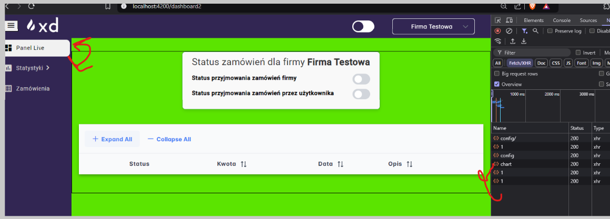
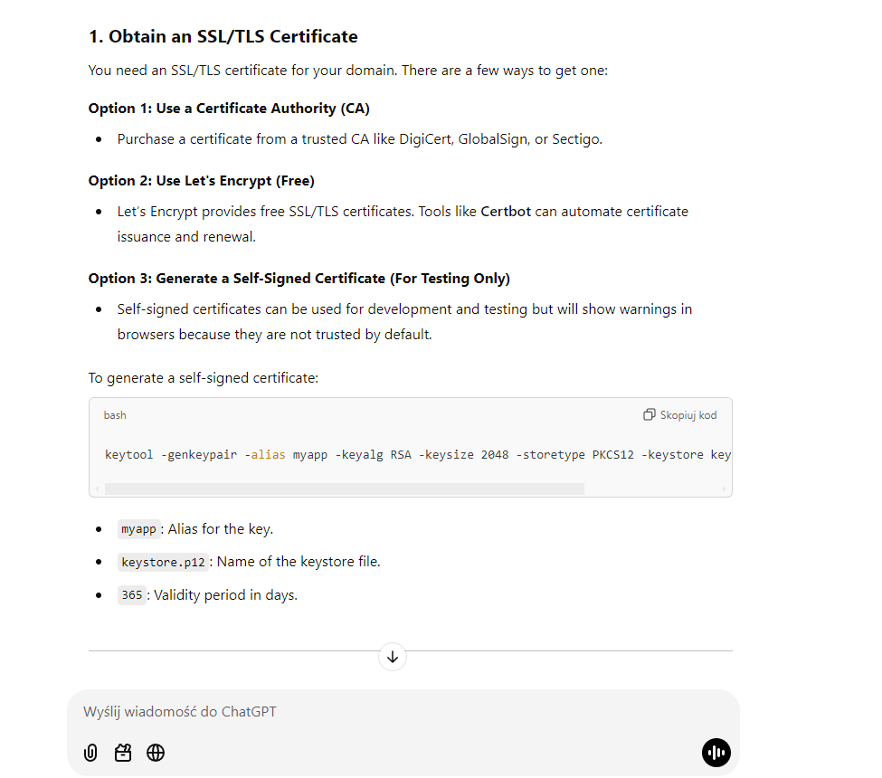
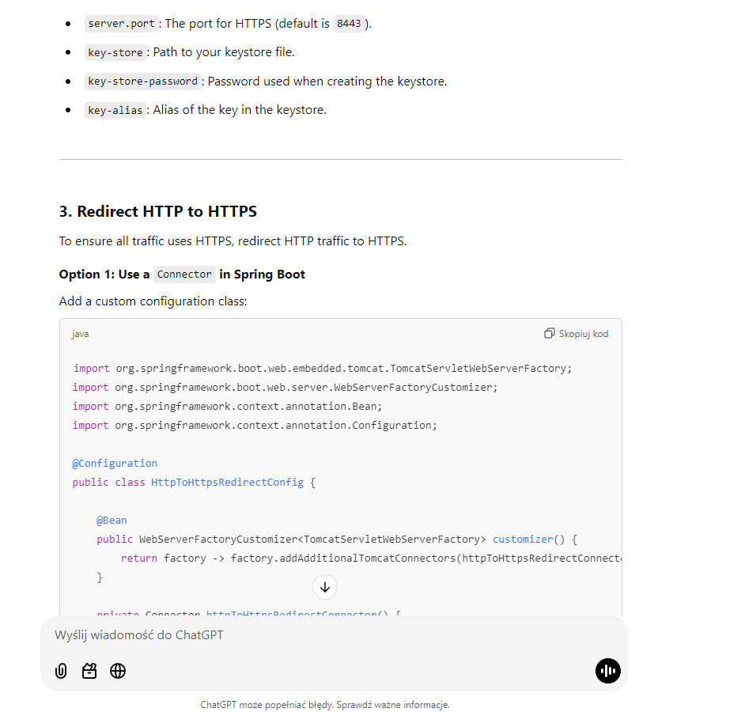
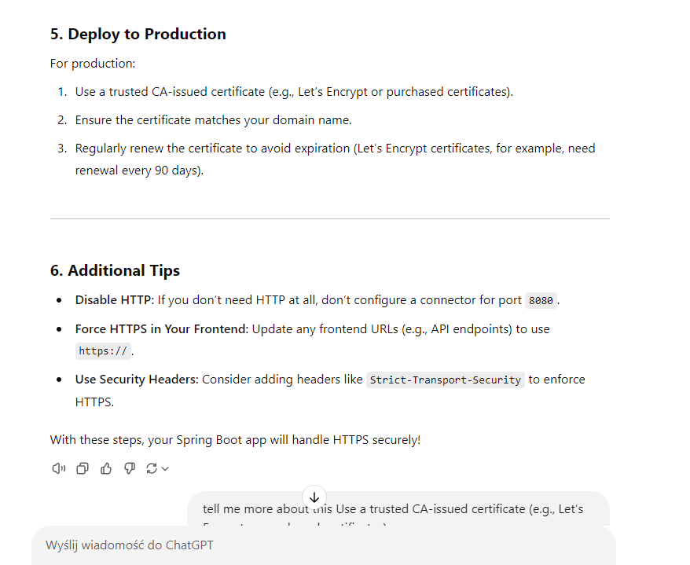
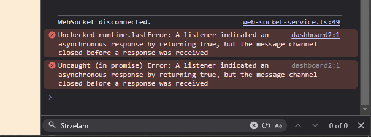
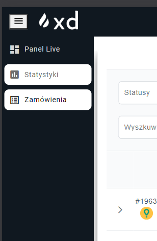
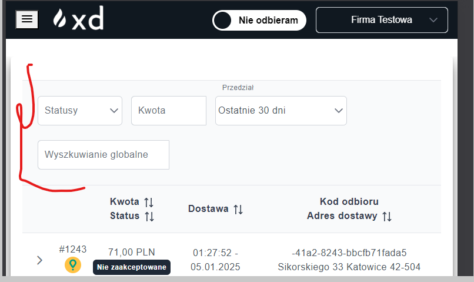

1. Poprawic sidebar grubosci moze byc grubsze na plenym i cienszy na zwinietym
2 chyba na mniejszym rozmiarze jest sidbar z automatu otwarty a nie powinein byc

4.cos jest nie tak z handloawnie errorow bo np w statytyskach na charcie miaelm npe a return jest it tak 200 xd

5. nie wiem czy to zrobie teraz ale jak wciskamy odbieranie zamowien to po otworzeniu nowego okna juz tego nie odbieramy no i pytanie 
jak to zroic zeby sie na dwoch oknach odbieralo no bo jakbym mial pinga to ping tez podwojnie bedzie jebal moglbym zpaisac to w ciasteczkach
ze jest odbieranie ale to wciaz nie daje pelnej spojnosci miedzy oknami ;/

6. jesli ktos zostawi okienko nie ruszane i ten czas przeleci do konca i okienka sie zestackuja to i tak sie beda wyswielac z czasem 0
i odrazu znikac ;/

7. Zrobic jakis komunikat jak odbieramy ordery i checemy przejsc na inna firme to raczej odbieranie orderow powinno sie wyjebac

8. pamietac o dorobieniu sprawdzen uprawnien uzytkonika do firm na endpointach

##########

sql injection
######

w logach nie leci np             throw new SecurityException("Order is modified");!!!!!!!!!!!!!!!!!!!!!!!!!!!!!

######

//todo walidacja ordera i redirect jak jest stary front

######

w statysytkach trzeba chyba dorobic zliczanie po pordukcie zeby uwzglednil produkty zmodyfikowane bo inaczej sie nie wyswitla dane 

####

moze ucinac id na liscie do % 1000?

#####

jest jakies dziwne gowno jak sie kilka w expandlina to jest jakis overflow i pokazuje sie scroll z prawiej strony na danym rekordzie ;/ przy zwijaniu jest troche randomowe bo nie za kazdym razem sie pojawia

#####

aktywna sesja JWT - obecnie jest problem bo daje ze jest walid np 3dni wiec moze cie wyjebac w sorkdu roboty za 3 dni !!!!!!!!!

###########

ta rura robi resiza jak sie wyswielta caly opis xd

(prime ng ma tooltipa fjanie bedzie go uzyc)
ty chyba w zaleznosci od thema inaczej te rzeczy reaguja xdddd fluent-light
########

przyjrzenie sie intervala na froncie
(chyba czas na online cos nie szankuje
)
####

jakis mechanizm odrzucenia na froncie

###

LOGIII!!!

###

obsluga socketa na froncie na dc

###

double request po przejsciu i wroceniu na zakladke live panel

###
upewnic sie ze wszystkie observable sa niszczone na ngOnDestroy (z socketem jest okej?)

####
Nie ma 400 500 jak nulle leca znowu jakies gowno w tym catchu

####

edge case gdzie uzytklonik wylacza websocketa ale ma wciaz jedno zamowienie W Akceptacji to po zaakceptowaniu/odrzuceniu zamowienie bedzie mu lezalo (bo bez web socketa nie ma eventa gdzie idzie toast + odswiezenie listy xd)

czy w paylodzie powinno leciec widoczne haslo przy rejsetaracji i chyba logowaniu?

####

kurla przy przelogowaniy sie usera wyswietlaja sie te same zakladki co na poprzednim userze xd jak odswieze to dziala normlanie

####

moze dorby pomyslem bylo by dorobienie prawa na wyswietlenie w all orders czasu wstecz nielimitowanego i limitowanego zeby jakis jasiek
nie mogl widziec full zamowien

####

jak mamy tabletowego/zamknietego sidbara to po klikniejciu w powa zakladke raczej fajnie byloby jakby sie zamknal

####

ng prime ma fajny time line jak lifcycle moze dodac?

####

HTTPS! https://chatgpt.com/c/6780130b-bdc4-8002-ae13-69d7c107ca9c

https://www.youtube.com/watch?v=jrR_WfgmWEw

####

cos z tym soundListenerem

####

no niestaty ten sidebar na tabletowej rozdzialce nie podswietla wybranego (to wiedzialem) ale kiedy sie kilknie w inna ikonke to sie pdosweitlaja dwa na raz na rozwiniecie xd

###

pomyslec nad wybieraniem tej firmy bo popularny case bedzie ze ktos ma 4 firmy wirualne wiec zakladka wszystkie firmy bedzie na dole wiec przy odswiezeniu przekieruje nas na 1

###

no trzeba by pomyslec jak to zrobic na front endzie jesli websocket z backendu sie wyjebal ;/

###

trzeba by potestowac tego socketa na 2 uzytkowniach jdnoczesnie, jeden uzytkownik na dowch okienkach wyglda ze dziala wiec not bad

####

mozna by pomyslec o zrobieniu na froncie diaglgu kiedy user ma wlaczone odbieranie zamowien i zmienia firme

#####

pytanie czy ja musze cos robic kiedy otrzymam ordera na backendzie a front nic nie kliknie wiec order powinine zostac odrzucony 
ale nie mam wgle logiki ktora wysle cos dlo glovo wydaje mi sie ze nie musze nic miec ale to upewnienia sie w przyszlosci

###

moze byc case gdzie jedno okno ma 2 queued orders i drugi okno zobaczy najnowszego 3 ordera wiec pierwsze okno nie moze akceptowac/rejectowac
tego zamowienia xd do pomyslenia czy nie lepiel byloby dac tylko jednemu userowi z calej firmy w danym czase prawo do odbierania zamowien

##########

moze to powino byc tak jak unas na rozwijajce zeby byla tylko jedna linia?

PERMISSIONS

VIEW_ORDERS_HISTORY - prawo do podgladu zakladki Zamówienia oraz wszysktich endpointow zwiazanych z nim
VIEW_STATISTICS - prawo do podgladu zakladki Statystyki oraz wszysktich endpointow zwiazanych z nim
VIEW_ONLINE_ORDERING - prawo do podgladu zakladki Panel Live oraz wszysktich endpointow zwiazanych z nim
