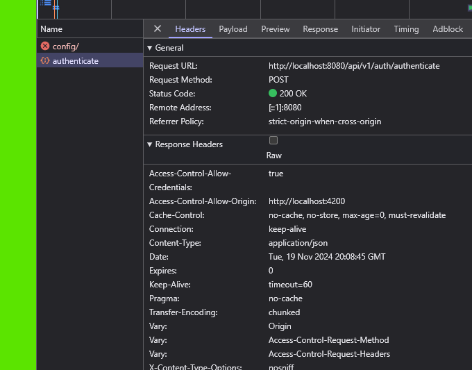
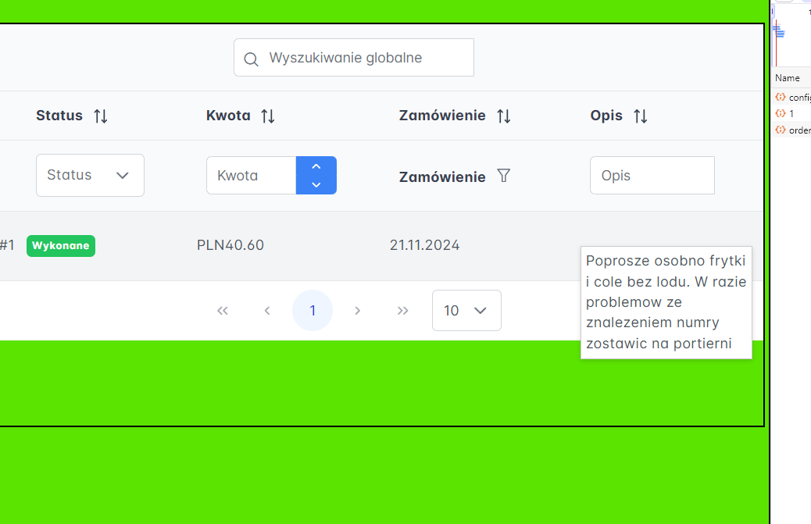

1. Poprawic sidebar grubosci moze byc grubsze na plenym i cienszy na zwinietym
2 chyba na mniejszym rozmiarze jest sidbar z automatu otwarty a nie powinein byc
3. JEABEN ALL-ORDERS I TE PIERDOLONE FILTRY raczje nie powinny byc w headerach tylko odzielnie wiece trzbe duzo przubudowac bo
sie kurla resizuja po dodaniu elelmtow i przeez to szerokosc kolumny sie zwieskzza np na statusie xd

4.cos jest nie tak z handloawnie errorow bo np w statytyskach na charcie miaelm npe a return jest it tak 200 xd

ehh cos usluga /config leci za szybko bo chyba pierwsze powinoo lecicec /authenticate

###########

ta rura robi resiza jak sie wyswielta caly opis xd

PERMISSIONS

VIEW_ORDERS - prawo do podgladu zakladki Zamówienia oraz wszysktich endpointow zwiazanych z nim
VIEW_STATISTICS - prawo do podgladu zakladki Statystyki oraz wszysktich endpointow zwiazanych z nim
VIEW_LIVE_PANEL - prawo do podgladu zakladki Panel Live oraz wszysktich endpointow zwiazanych z nim
