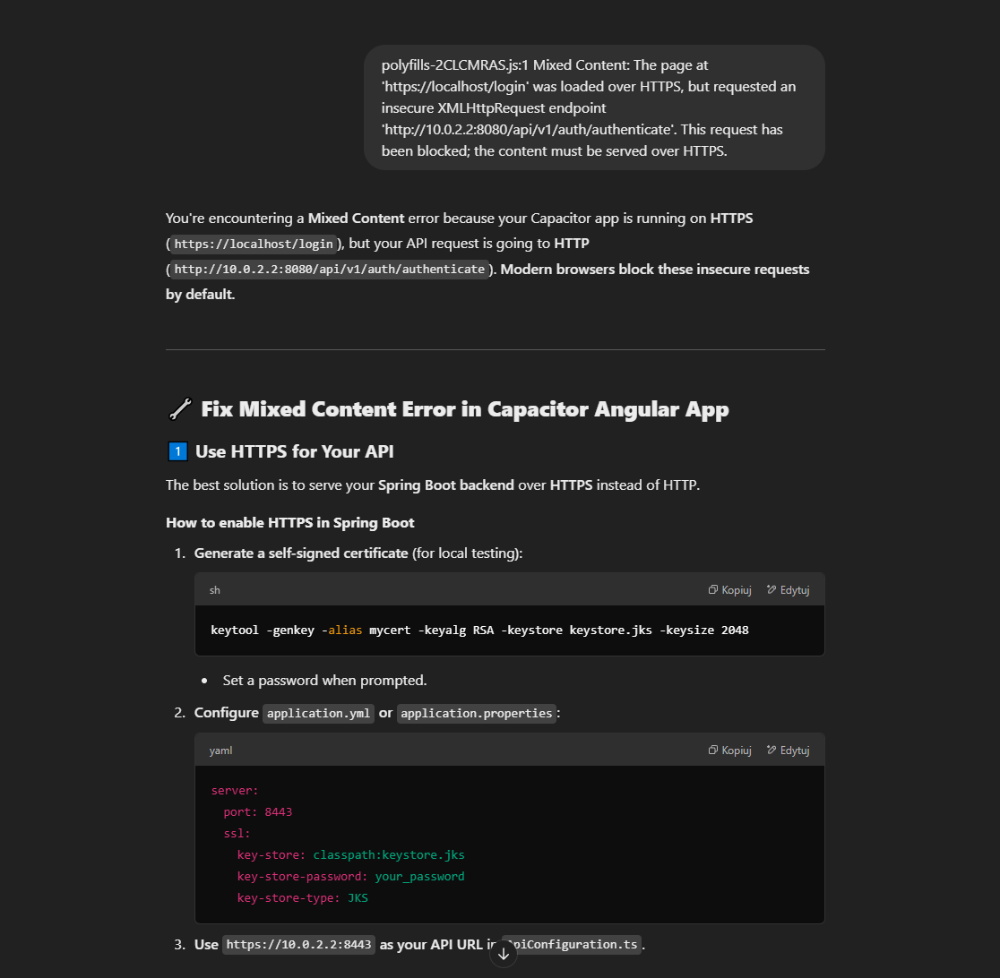
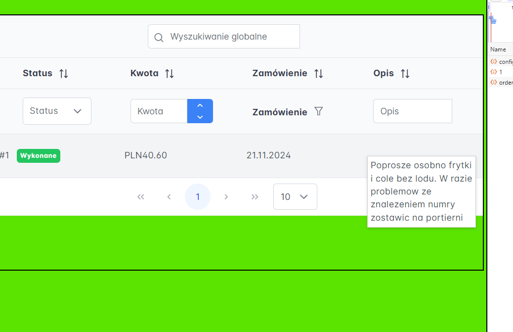
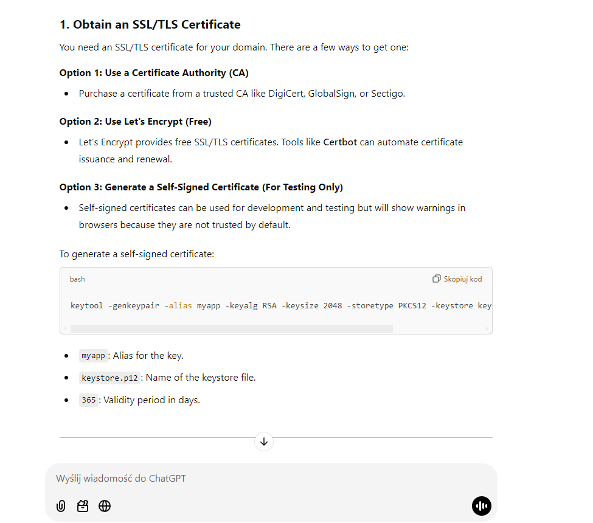
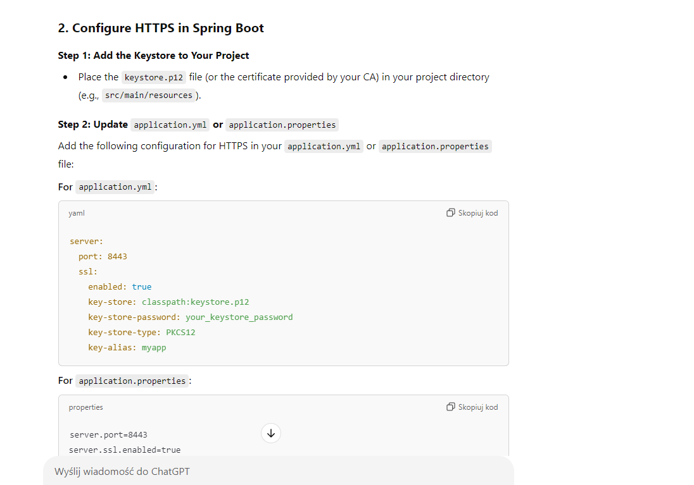
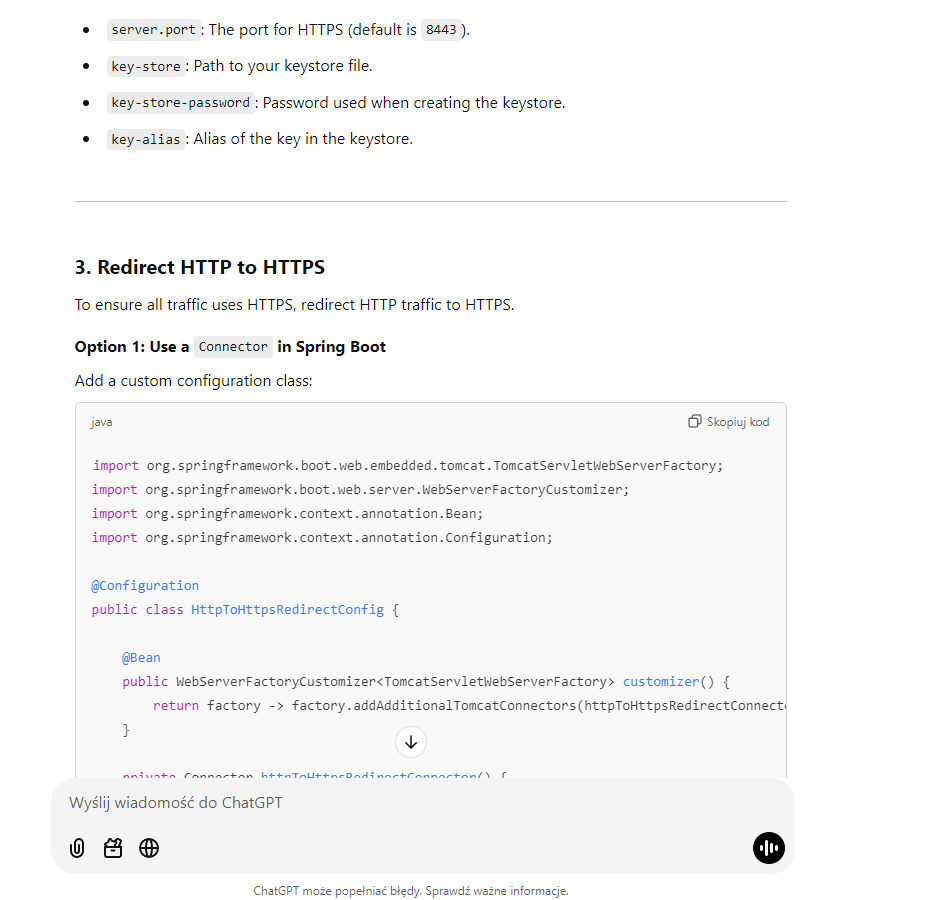
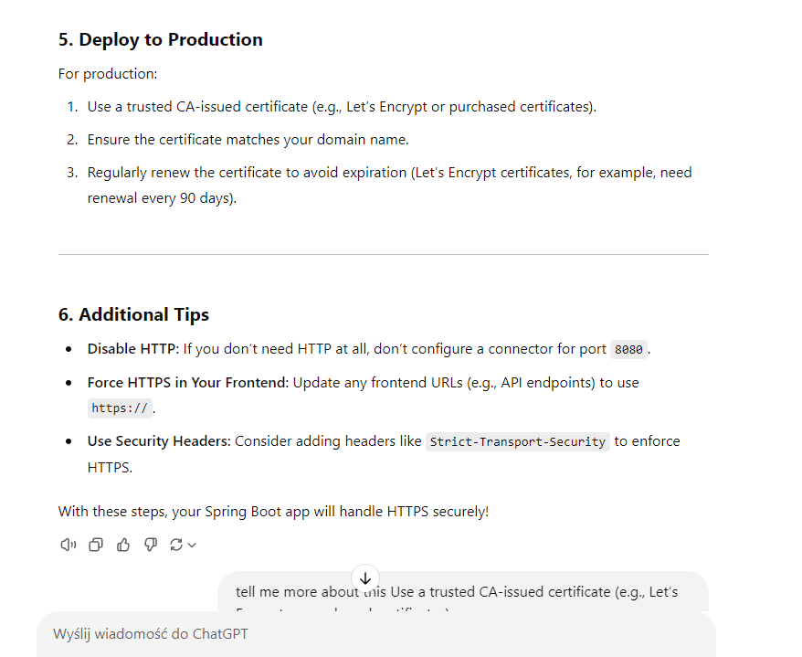
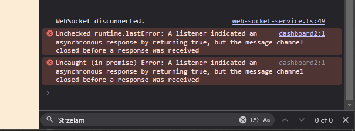
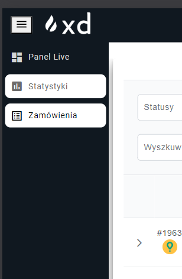
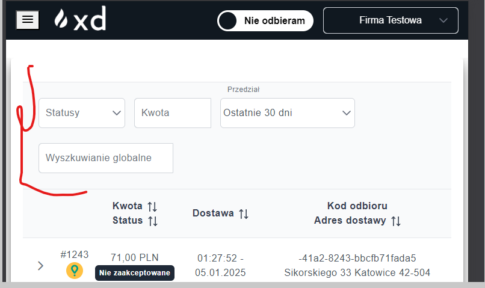

7. Zrobic jakis komunikat jak odbieramy ordery i checemy przejsc na inna firme to raczej odbieranie orderow powinno sie wyjebac

##########

poprawic klucz api google pod domene 

######

statystyki z uwglednieniem dowozoow

#######

ogolnie BT na froncie dziala ale jest jakis dziwny blad kiedy mnie rozlaczy i sie jeszcze raz probuje polaczyc z usatwien i trzeba resetowac apke
najpierw pokazuje ze sie polaczyc i w sumie drukarka swieci ze jest polacznie ale przy zmianie zakladki apka stwietrdeza ze jednka nie ma polaczenia

######

####

sql injection

######

w statysytkach trzeba chyba dorobic zliczanie po pordukcie zeby uwzglednil produkty zmodyfikowane bo inaczej sie nie wyswitla dane

ta rura robi resiza jak sie wyswielta caly opis xd

(prime ng ma tooltipa fjanie bedzie go uzyc)
ty chyba w zaleznosci od thema inaczej te rzeczy reaguja xdddd fluent-light
########

przyjrzenie sie intervala na froncie
(chyba czas na online cos nie szankuje
)
####

jakis mechanizm odrzucenia na froncie

###

obsluga socketa na froncie na dc

####

edge case gdzie uzytklonik wylacza websocketa ale ma wciaz jedno zamowienie W Akceptacji to po zaakceptowaniu/odrzuceniu zamowienie bedzie mu lezalo (bo bez web socketa nie ma eventa gdzie idzie toast + odswiezenie listy xd)

####

kurla przy przelogowaniy sie usera wyswietlaja sie te same zakladki co na poprzednim userze xd jak odswieze to dziala normlanie

####

HTTPS! https://chatgpt.com/c/6780130b-bdc4-8002-ae13-69d7c107ca9c

https://www.youtube.com/watch?v=jrR_WfgmWEw

####

cos z tym soundListenerem

####

no niestaty ten sidebar na tabletowej rozdzialce nie podswietla wybranego (to wiedzialem) ale kiedy sie kilknie w inna ikonke to sie pdosweitlaja dwa na raz na rozwiniecie xd

###

pomyslec nad wybieraniem tej firmy bo popularny case bedzie ze ktos ma 4 firmy wirualne wiec zakladka wszystkie firmy bedzie na dole wiec przy odswiezeniu przekieruje nas na 1

###

no trzeba by pomyslec jak to zrobic na front endzie jesli websocket z backendu sie wyjebal ;/

###

trzeba by potestowac tego socketa na 2 uzytkowniach jdnoczesnie, jeden uzytkownik na dowch okienkach wyglda ze dziala wiec not bad

####

mozna by pomyslec o zrobieniu na froncie diaglgu kiedy user ma wlaczone odbieranie zamowien i zmienia firme

###

moze byc case gdzie jedno okno ma 2 queued orders i drugi okno zobaczy najnowszego 3 ordera wiec pierwsze okno nie moze akceptowac/rejectowac
tego zamowienia xd do pomyslenia czy nie lepiel byloby dac tylko jednemu userowi z calej firmy w danym czase prawo do odbierania zamowien

##########

moze to powino byc tak jak unas na rozwijajce zeby byla tylko jedna linia?

PERMISSIONS

VIEW_ORDERS_HISTORY - prawo do podgladu zakladki Zamówienia oraz wszysktich endpointow zwiazanych z nim
VIEW_STATISTICS - prawo do podgladu zakladki Statystyki oraz wszysktich endpointow zwiazanych z nim
VIEW_ONLINE_ORDERING - prawo do podgladu zakladki Panel Live oraz wszysktich endpointow zwiazanych z nim
